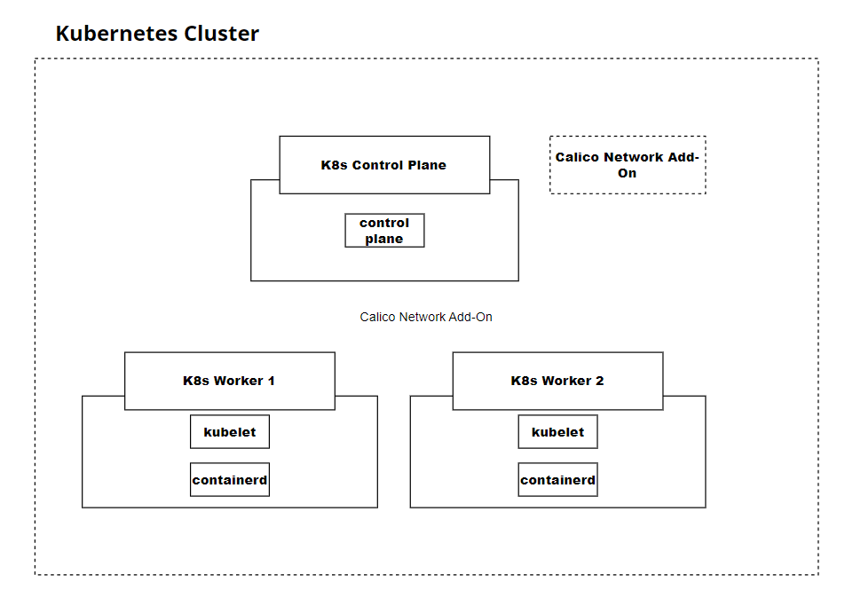

# Building a Kubernetes 1.27 Cluster with `kubeadm`



## **Introduction**
This guide shows how to install and use `kubeadm` to build a Kubernetes cluster on your servers.

The container runtime we will be using is  `containerd`

The cluster should have **one** control panel node and **two** worker nodes.
- Server-1 (control plane node)
- Server-2 (worker node 1)
- Server-3 (worker node 2)

`Calico networking add-on` will be used in this template to provide networking for the cluster.


## **Prerequest**
1. 3 ubuntu servers/vms (OS prefer - `Ubuntu 20.04.5 LTS`)
   

## **Steps**
 ### **Install Packages**
  1. Login into the control plane server (Server-1)
  2. Create the configuration file for `containerd`
        ```
        cat <<EOF | sudo tee /etc/modules-load.d/containerd.conf
        overlay
        br_netfilter
        EOF
        ```
  3. Load the modules into the kernel
        ```
        sudo modprod overlay
        sudo modprod br_netfilter
        ```
  4. Set the system configurations for Kubernetes networking:
        ```
        cat <<EOF | sudo tee /etc/sysctl.d/99-kubernetes-cri.conf
        net.bridge.bridge-nf-call-iptables = 1
        net.ipv4.ip_forward = 1
        net.bridge.bridge-nf-call-ip6tables = 1
        EOF
        ```
  5. Apply the new settings
        ```
        sudo sysctl --system
        ```
  6. Install containerd
        ```
        sudo apt-get update && sudo apt-get install -y containerd.io
        ```
  7. Create the default configuration file for containerd:
        ```
        sudo mkdir -p /etc/containerd
        ```
  8. Generate the default containerd configuration, and save it to the newly created default file:
        ```
        sudo containerd config default | sudo tee /etc/containerd/config.toml
        ```
  9. Restart containerd to ensure the new configuration file is used:
        ```
        sudo systemctl restart containerd
        ```
  10.  Verify that containerd is running:
        ```
        sudo systemctl status containerd
        ```
  11.  Disable swap:
        ```
        sudo swapoff -a
        ```
  12.  Install the dependency packages
        ```
        sudo apt-get update && sudo apt-get install -y apt-transport-https curl
        ```
  13.  Download and add the GPG key:
        ```
        curl -s https://packages.cloud.google.com/apt/doc/apt-key.gpg | sudo apt-key add -
        ```
  14.  Add kubernetes to the repository list:
        ```
        cat <<EOF | sudo tee /etc/apt/sources.list.d/kubernetes.list
        deb https://apt.kubernetes.io/ kubernetes-xenial main
        EOF
        ```
  15.  Update the package listings
        ```
        sudo apt-get update
        ```
  16.  Install Kubernetes packages:
        ```
        sudo apt-get install -y kubelet=1.27.0-00 kubeadm=1.27.0-00 kubectl=1.27.0-00
        ```
  17.  Turn off automatic updates
        ```
        sudo apt-mark hold kubelet kubeadm kubectl
        ```
  18.  Login to both worker nodes (Server-2 and Server-3) to perform the previos steps

### **Initialize the Cluster** ###
  1. Login to the control plane node ()
  2. Initialize the Kubernetes cluster on the control plane node using `kubeadm`:
        ```
        sudo kubeadm init --pod-network-cidr 192.168.0.0/16 --kubernetes-version 1.27.0
        ```
  3. Set `kubectl` access:
        ```
        mkdir -p $HOME/.kube
        sudo cp -i /etc/kubernetes/admin.conf $HOME/.kube/config
        sudo chown $(id -u):$(id -g) $HOME/.kube/config
        ``` 
  4. Test access to the cluster
        ```
        kubectl get nodes
        ```

### **Install the Calico Network Add-On** ###
1. On the control plane node, install Calico Networking:
    ```
    kubectl apply -f https://raw.githubusercontent.com/projectcalico/calico/v3.25.0/manifests/calico.yaml
    ```
2. Check the status of the control plane node:
    ```
    kubectl get nodes
    ```


### **Join the Worker Nodes to the Cluster** ###
1. In the control plane node, create the token and copy the `kubeadm join` command:
    ```
    kubeadm token create --print-join-command
    ```
2. Copy the full output from the previous command used in the control plane node. This command starts with `kubeadm join`.

3. In both worker nodes, paste the full `kubeadm join` command to join the cluster. Use `sudo` to run it as root:
    ```
    sudo kubeadm join...
    ```
4. In the control plane node, view the cluster status by enter the following command. You should see all your worker nodes are joining the control plane node:
    ```
    kubectl get nodes
    ```